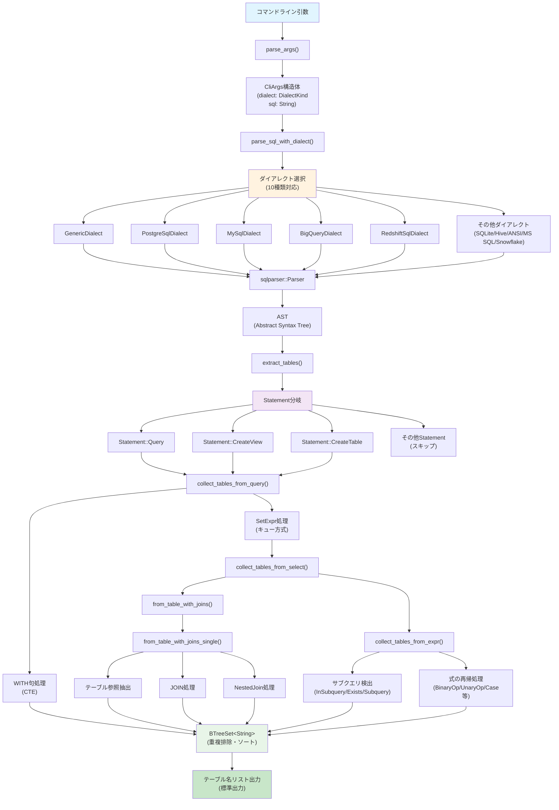
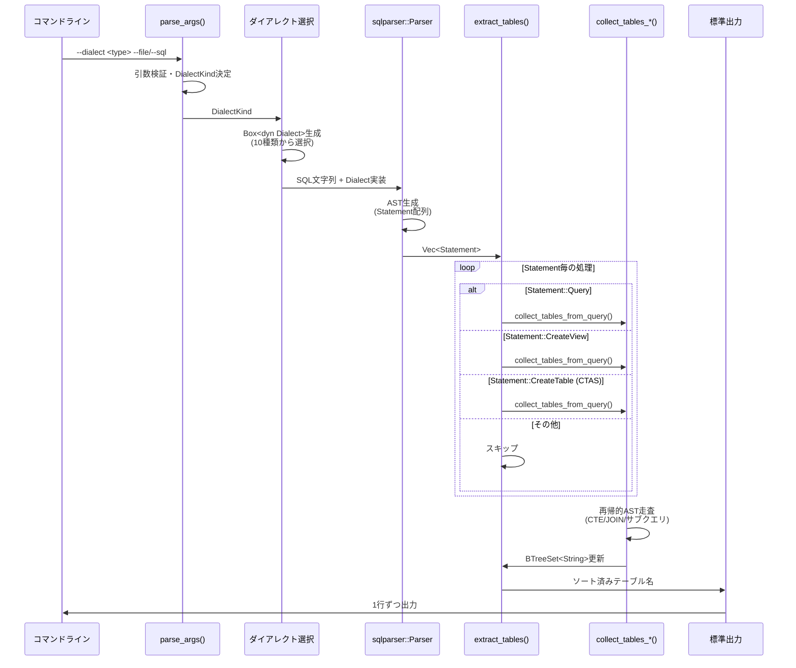
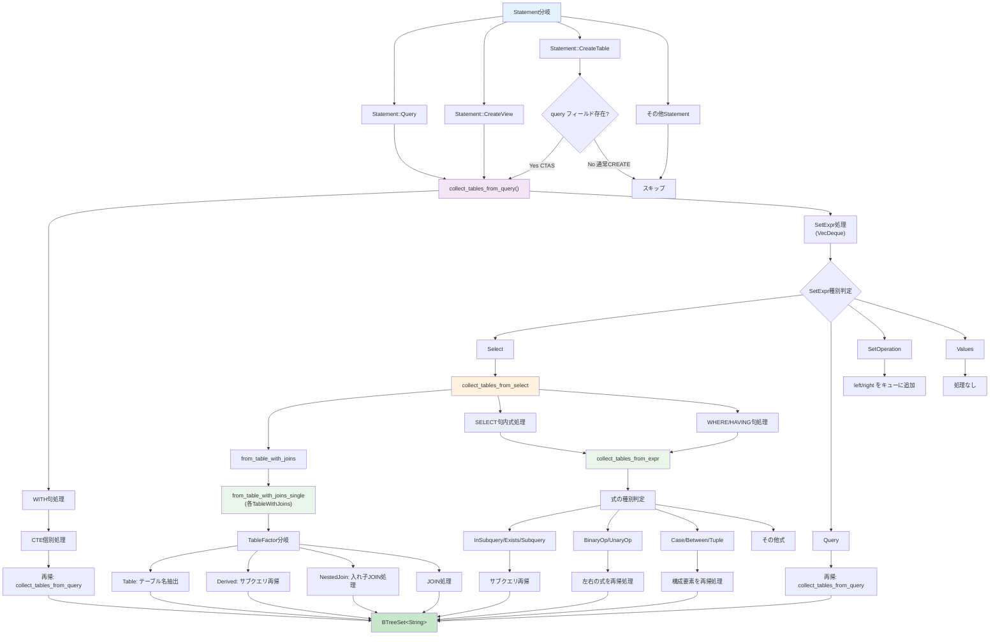

# SQL Parser アーキテクチャ設計書

## 概要

`sqlparser` は、SQLクエリからテーブル名を抽出するRust製のコマンドライン・ツールです。複数のSQLダイアレクトに対応し、複雑なSQL構文（CTE、サブクエリ、JOIN、セット演算など）を解析してテーブル依存関係を特定できます。

## 目次

- [プロジェクト概要](#プロジェクト概要)
- [システムアーキテクチャ](#システムアーキテクチャ)
- [データ構造設計](#データ構造設計)
- [機能設計](#機能設計)
- [アルゴリズム設計](#アルゴリズム設計)
- [インターフェース設計](#インターフェース設計)
- [実装の特徴](#実装の特徴)
- [拡張性](#拡張性)

## プロジェクト概要

### 基本情報
- **プロジェクト名**: sqlparser
- **バージョン**: 0.1.0
- **言語**: Rust (edition 2024)
- **主要依存関係**: sqlparser 0.47

### 主要機能
1. **複数SQLダイアレクト対応**
   - Generic SQL
   - PostgreSQL
   - MySQL
   - Microsoft SQL Server
   - Snowflake
   - Google BigQuery
   - SQLite
   - Apache Hive
   - ANSI SQL標準
   - Amazon Redshift

2. **高度なSQL構文サポート**
   - CTE (Common Table Expression)
   - ネストしたサブクエリ
   - 複数テーブルJOIN
   - セット演算 (UNION, INTERSECT, EXCEPT)
   - CREATE VIEW文
   - CREATE TABLE AS SELECT文

3. **柔軟な入力方法**
   - SQLファイルからの読み込み
   - コマンドライン引数での直接指定

## システムアーキテクチャ

### システム構成図



### データフロー



### モジュール構成

```
src/
└── main.rs (単一ファイル構成)
    ├── 引数解析機能
    │   ├── parse_args()
    │   └── CliArgs構造体
    ├── SQLパース機能
    │   ├── DialectKind列挙型
    │   └── parse_sql_with_dialect()
    ├── テーブル抽出機能
    │   ├── extract_tables()
    │   ├── collect_tables_from_query()
    │   ├── collect_tables_from_select()
    │   ├── collect_tables_from_expr()
    │   ├── from_table_with_joins()
    │   └── object_name_to_string()
    └── メイン処理
        └── main()
```

## データ構造設計

### 主要な構造体・列挙型

#### DialectKind (列挙型)
```rust
#[derive(Debug, Clone, Copy)]
enum DialectKind {
    Generic,    // 汎用SQL
    Postgres,   // PostgreSQL
    MySql,      // MySQL
    MsSql,      // Microsoft SQL Server
    Snowflake,  // Snowflake
}
```

**用途**: SQLダイアレクトの種類を表現し、適切なパーサーを選択

#### CliArgs (構造体)
```rust
#[derive(Debug)]
struct CliArgs {
    dialect: DialectKind,  // 使用するSQLダイアレクト
    sql: String,           // 解析対象のSQL文字列
}
```

**用途**: コマンドライン引数から解析された設定情報を保持

### データ管理戦略

- **テーブル名の一意性**: `BTreeSet<String>` による自動重複排除・ソート
- **AST探索**: 再帰的な深さ優先探索
- **メモリ効率**: 所有権システムによる安全なメモリ管理

## 機能設計

### コア機能アーキテクチャ

#### SQLパース機能
```
parse_sql_with_dialect()
├── 入力: SQL文字列、ダイアレクト種別
├── 処理: 適切なダイアレクト実装の選択・AST生成
└── 出力: Statement配列またはエラー
```

#### テーブル抽出機能階層
```
extract_tables()
├── Statement::Query処理
│   └── collect_tables_from_query()
│       ├── WITH句処理 (CTE)
│       ├── collect_tables_from_select()
│       │   ├── from_table_with_joins()
│       │   │   ├── テーブル参照抽出
│       │   │   ├── JOIN処理
│       │   │   └── ネストJOIN処理
│       │   └── collect_tables_from_expr()
│       │       ├── サブクエリ抽出
│       │       ├── EXISTS/IN句処理
│       │       └── CASE/BETWEEN式処理
│       └── セット演算処理 (UNION等)
├── Statement::CreateView処理
│   └── collect_tables_from_query() (再帰)
└── Statement::CreateTable処理
    └── collect_tables_from_query() (CTAS用)
```

### 対応SQL構文

#### 基本構文
- `SELECT ... FROM table_name`
- `JOIN` (INNER, LEFT, RIGHT, FULL OUTER)
- `WHERE`, `HAVING` 句
- エイリアス (`AS` 句)

#### 高度な構文
- **CTE (Common Table Expression)**
  ```sql
  WITH cte_name AS (SELECT ...)
  SELECT ... FROM cte_name
  ```

- **サブクエリ**
  ```sql
  SELECT ... WHERE col IN (SELECT ...)
  SELECT ... WHERE EXISTS (SELECT ...)
  ```

- **セット演算**
  ```sql
  SELECT ... UNION SELECT ...
  SELECT ... INTERSECT SELECT ...
  ```

- **ネストしたJOIN**
  ```sql
  FROM (table1 JOIN table2) JOIN table3
  ```

- **派生テーブル**
  ```sql
  FROM (SELECT ... FROM table1) AS derived
  ```

#### DDL文サポート
- **CREATE VIEW文**
  ```sql
  CREATE OR REPLACE VIEW view_name AS
  SELECT ... FROM table1 JOIN table2 ...
  ```

- **CREATE TABLE AS SELECT文**
  ```sql
  CREATE TABLE new_table AS
  SELECT ... FROM existing_table
  ```

## アルゴリズム設計

### テーブル抽出アルゴリズム

#### 基本戦略
1. **深さ優先探索**: ASTを再帰的に走査
2. **幅優先キュー**: セット演算の処理にVecDequeを使用
3. **重複排除**: BTreeSetによるテーブル名の一意性保証

#### 探索パターン図



#### パフォーマンス特性
- **時間計算量**: O(n) - nはASTノード数
- **空間計算量**: O(m) - mは一意なテーブル名数  
- **メモリ効率**: 参照渡しによるClone最小化

### 抽出ロジックの詳細

#### FROM句・JOIN処理
```rust
// TableFactorの種類に応じた処理
match &table_factor {
    Table { name, .. } => {
        // 直接テーブル参照
        tables.insert(object_name_to_string(name));
    }
    Derived { subquery, .. } => {
        // サブクエリの再帰処理
        collect_tables_from_query(subquery, tables);
    }
    NestedJoin { table_with_joins, .. } => {
        // ネストしたJOINの処理
        // ...
    }
}
```

#### 式内サブクエリ処理
```rust
match expr {
    InSubquery { subquery, .. } |
    Exists { subquery, .. } |
    Subquery(subquery) => {
        collect_tables_from_query(subquery, tables);
    }
    BinaryOp { left, right, .. } => {
        // 左右の式を再帰処理
        collect_tables_from_expr(left, tables);
        collect_tables_from_expr(right, tables);
    }
    // ...
}
```

## インターフェース設計

### コマンドライン引数仕様

```bash
# 基本使用法
sqlparser --dialect <dialect> --file <path>
sqlparser --dialect <dialect> --sql "<sql_query>"

# パラメータ詳細
--dialect <value>   # 必須: generic|postgres|mysql|mssql|snowflake|bigquery|sqlite|hive|ansi|redshift
--file <path>       # SQLファイルパス (--sqlと排他)
--sql "<query>"     # SQL文字列直接指定 (--fileと排他)
```

### 使用例

```bash
# ファイルから読み込み
$ sqlparser --dialect postgres --file ./sql/complex.sql
customers
orders
order_items
products
customer_stats
recent_orders

# 各ダイアレクト別の使用例
$ sqlparser --dialect mysql --sql "SELECT * FROM users JOIN profiles USING(id)"
users
profiles

$ sqlparser --dialect bigquery --sql "SELECT * FROM project_dataset_table"
project_dataset_table

$ sqlparser --dialect sqlite --sql "SELECT * FROM users LIMIT 10"
users

$ sqlparser --dialect hive --sql "SELECT * FROM warehouse.users WHERE year=2023"
warehouse.users

$ sqlparser --dialect redshift --sql "SELECT * FROM sales.orders"
sales.orders
```

### 出力形式

- **成功時**: テーブル名を1行ずつ出力（アルファベット順）
- **エラー時**: 標準エラー出力にメッセージ

### エラーハンドリング

| エラー種別 | 終了コード | 出力先 | 詳細 |
|-----------|-----------|--------|------|
| 引数エラー | 2 | stderr | 使用法とエラーメッセージ |
| SQLパースエラー | 1 | stderr | パースエラー詳細 |
| ファイル読み込みエラー | 2 | stderr | ファイルアクセスエラー |

## 実装の特徴

### 使用技術・ライブラリ

#### 外部依存関係
- **sqlparser (0.47)**: 
  - 高性能SQLパースエンジン
  - 複数ダイアレクト対応
  - 完全なAST生成

#### 標準ライブラリ活用
- **std::collections::BTreeSet**: ソート済み一意集合
- **std::collections::VecDeque**: 効率的なキュー操作
- **std::fs**: ファイルI/O
- **std::env**: コマンドライン引数処理

### 設計パターン

#### Strategy Pattern (ダイアレクト選択)
```rust
let dialect_impl: Box<dyn Dialect> = match dialect {
    DialectKind::Generic => Box::new(GenericDialect {}),
    DialectKind::Postgres => Box::new(PostgreSqlDialect {}),
    // ...
};
```

#### Visitor Pattern (AST走査)
- 各AST ノード型に対応した専用関数
- 再帰的な深さ優先探索
- 副作用による結果集積

#### Queue Pattern (セット演算)
```rust
let mut queue: VecDeque<SetExpr> = VecDeque::new();
while let Some(expr) = queue.pop_front() {
    // 処理...
}
```

### メモリ管理戦略

#### 所有権・借用
- **参照渡し優先**: Cloneを最小限に抑制
- **Box使用**: 動的ディスパッチの効率化
- **借用チェッカー**: コンパイル時メモリ安全性

#### データ構造選択
- **BTreeSet**: 自動ソート・重複排除
- **VecDeque**: 両端効率アクセス
- **String**: UTF-8文字列の安全処理

## 拡張性

### 対応可能な拡張項目

#### 1. 新しいSQL構文サポート
- **関数内サブクエリ**: `FUNCTION(SELECT ...)`
- **ウィンドウ関数**: `OVER (PARTITION BY ...)`
- **再帰CTE**: `WITH RECURSIVE ...`

#### 2. 新しいSQLダイアレクト
現在対応済みのダイアレクト一覧：

**クラウドデータウェアハウス**
- ✅ Google BigQuery (bigquery)
- ✅ Snowflake (snowflake)
- ✅ Amazon Redshift (redshift)

**従来型データベース**
- ✅ PostgreSQL (postgres/postgresql)
- ✅ MySQL (mysql)
- ✅ Microsoft SQL Server (mssql)
- ✅ SQLite (sqlite)

**ビッグデータ・分析**
- ✅ Apache Hive (hive)

**標準・汎用**
- ✅ ANSI SQL標準 (ansi)
- ✅ 汎用SQL (generic)

**将来対応候補**
- Oracle Database
- Teradata
- DuckDB
- ClickHouse

#### 3. 追加DML/DDL文対応
```rust
// 現在対応済み
Statement::CreateView { query, .. } => collect_tables_from_query(query, &mut tables),
Statement::CreateTable { query, .. } => { /* CTAS処理 */ },

// 将来対応予定
Statement::Insert(insert) => extract_from_insert(insert),
Statement::Update(update) => extract_from_update(update), 
Statement::Delete(delete) => extract_from_delete(delete),
```

#### 4. 出力形式拡張
- **JSON形式**: 構造化されたテーブル依存情報
- **GraphViz**: 視覚的な依存関係図
- **CSV**: 表形式での分析用データ

#### 5. 詳細分析機能
- **テーブル種別判定**: テーブル vs ビュー vs CTE
- **依存関係深度**: ネスト レベル分析
- **列レベル依存**: 使用カラム抽出

### 現在の制限事項

#### 対応範囲の制限
1. **DML文の一部未対応**: INSERT/UPDATE/DELETE未対応（SELECT, CREATE VIEW, CREATE TABLE AS SELECT は対応済み）
2. **関数内式未解析**: `FUNCTION(SELECT ...)` 形式
3. **オブジェクト種別未分類**: テーブル・ビュー・プロシージャの区別なし
4. **スキーマ情報未検証**: 存在しないテーブルでもエラーにならない

#### アーキテクチャ上の制約
1. **単一ファイル構成**: 大規模化時の保守性
2. **同期処理のみ**: 非同期I/Oは未対応
3. **メモリ内処理**: 大容量SQLファイルの制限

### 拡張実装ガイド

#### 新ダイアレクト追加手順
```rust
// 1. 列挙型に追加
enum DialectKind {
    // ...
    Oracle,
}

// 2. マッチ処理に追加  
match dialect {
    // ...
    DialectKind::Oracle => Box::new(OracleDialect {}),
}

// 3. 引数処理に追加
match v.to_lowercase().as_str() {
    // ...
    "oracle" => DialectKind::Oracle,
}
```

#### 新構文サポート追加
```rust
// extract_tables()関数を拡張
match stmt {
    Statement::Query(q) => collect_tables_from_query(q, &mut tables),
    
    // 現在対応済み
    Statement::CreateView { query, .. } => {
        collect_tables_from_query(query, &mut tables);
    }
    Statement::CreateTable { query, .. } => {
        if let Some(q) = query {
            collect_tables_from_query(q, &mut tables);
        }
    }
    
    // 将来追加予定
    Statement::Insert(i) => collect_tables_from_insert(i, &mut tables),
    // 新しい文型への対応
}
```

## テスト設計

### テストケース分類

#### 基本機能テスト
1. **シンプルSELECT**: `SELECT * FROM table1`
2. **複数テーブル**: `SELECT * FROM table1, table2`  
3. **エイリアス**: `SELECT * FROM table1 AS t1`

#### JOIN機能テスト
1. **INNER JOIN**: `... INNER JOIN table2 ON ...`
2. **外部結合**: `LEFT/RIGHT/FULL OUTER JOIN`
3. **ネストJOIN**: `FROM (table1 JOIN table2) JOIN table3`

#### 高度構文テスト
1. **CTE**: `WITH cte AS (...) SELECT ...`
2. **サブクエリ**: `WHERE id IN (SELECT ...)`
3. **セット演算**: `SELECT ... UNION SELECT ...`

#### エラーケーステスト
1. **構文エラー**: 不正なSQL
2. **引数エラー**: 未知のダイアレクト
3. **ファイルエラー**: 存在しないファイル

### 提供テストファイル

#### sample1.sql (基本テスト)
```sql
select name
from users;
```
**期待結果**: `users`

#### create_view_sample1.sql (CREATE VIEW テスト)
```sql
create or replace view v_sample1 as
select name
from users;
```
**期待結果**: `users`

#### complex.sql (統合テスト)  
```sql
WITH recent_orders AS (
    SELECT customer_id, order_date, total_amount
    FROM orders 
    WHERE order_date >= '2023-01-01'
),
customer_stats AS (
    SELECT 
        c.customer_id,
        c.name,
        COUNT(ro.customer_id) as order_count,
        SUM(ro.total_amount) as total_spent
    FROM customers c
    LEFT JOIN recent_orders ro ON c.customer_id = ro.customer_id
    GROUP BY c.customer_id, c.name
)
SELECT 
    cs.name,
    cs.order_count,
    cs.total_spent,
    p.product_name
FROM customer_stats cs
JOIN order_items oi ON cs.customer_id = oi.customer_id
JOIN products p ON oi.product_id = p.product_id
WHERE cs.total_spent > (
    SELECT AVG(total_spent) 
    FROM customer_stats
)
ORDER BY cs.total_spent DESC;
```

**期待結果**: 
```
customers
customer_stats
order_items
orders  
products
recent_orders
```

## 結論

`sqlparser` は、単一ファイル構成でありながら、複雑なSQL構文に対応した堅牢で拡張可能なアーキテクチャを持つツールです。Rustの所有権システムとsqlparserライブラリを活用することで、高性能で安全なSQL解析を実現しています。

明確な責任分離、再帰的な探索アルゴリズム、効率的なデータ構造の選択により、保守性と性能を両立した設計となっています。今後の機能拡張や新しいSQLダイアレクトへの対応も容易に行える柔軟性を備えています。
